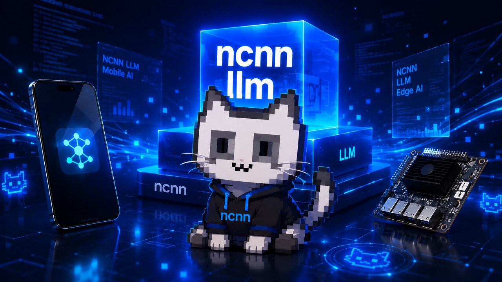

<p align="center">
  
</p>

<h1 align="center">ncnn_llm</h1>

<p align="center">
  <b>LLM, VLM, OCR, translation, and embedding inference on top of ncnn.</b>
</p>

<p align="center">
  <a href="LICENSE"></a>
  
  
  
</p>

<p align="center">
  <a href="README_CN.md">中文文档</a>
  ·
  <a href="#quick-start">Quick Start</a>
  ·
  <a href="#supported-models">Supported Models</a>
  ·
  <a href="#model-zoo">Model Zoo</a>
</p>

---

`ncnn_llm` provides a lightweight C++ runtime for running language models and embedding models with [ncnn](https://github.com/Tencent/ncnn). It focuses on practical local inference for edge devices, desktop CPU, and Vulkan-capable GPUs.

The project started from **nihui's** experimental ncnn `kvcache` work and expands it into reusable examples, model loaders, tokenizers, vision preprocessing, OCR inference, and embedding APIs.

## Highlights

- Unified CLI runner for chat and vision-language models
- KV-cache autoregressive decoding with CPU and optional Vulkan execution
- Qwen / MiniCPM style LLM support
- Qwen VL image input support
- GLM-OCR image-to-text example
- NLLB translation example
- Text and multimodal embedding APIs
- BPE and Unigram tokenizer support
- xmake-based build with small standalone examples

## Supported Models

| Category | Model | Status | Notes |
| --- | --- | --- | --- |
| LLM | YoutuLLM | Supported | Chat / text generation |
| LLM | MiniCPM4 | Supported | Chat / text generation |
| LLM | Qwen3 | Supported | Chat / text generation |
| VLM | Qwen3.5 | Supported | Image + text input |
| VLM | Qwen2.5-VL | Supported | Image + text input |
| ASR | Qwen3-ASR | In progress | Export scaffold for audio encoder + text stack |
| OCR | GLM-OCR | Supported | OCR |
| Translation | NLLB | Supported | Translation example |
| Embedding | Jina-Embeddings-v5-Text-Nano | Supported | 768-dim text embeddings |
| Embedding | Jina-CLIP-v2 | Supported | 1024-dim text + image embeddings |

## Quick Start

### 1. Requirements

- `xmake`
- ncnn built from `master`

### 2. Clone

```bash
git clone https://github.com/futz12/ncnn_llm.git
cd ncnn_llm
```

### 3. Build

```bash
xmake build
```

Build a single target:

```bash
xmake build llm_ncnn_run
```

### 4. Download Models

Download converted ncnn model directories from the mirror:

https://mirrors.sdu.edu.cn/ncnn_modelzoo/

Put the model directory under `assets/`, for example:

```text
assets/
└── qwen3_0.6b/
    ├── model.json
    ├── *.ncnn.param
    ├── *.ncnn.bin
    └── tokenizer files
```

## CLI Chat

`llm_ncnn_run` is the main interactive example for text and vision-language models.

```bash
xmake run llm_ncnn_run --model ./assets/qwen3_0.6b
```

With explicit runtime options:

```bash
xmake run llm_ncnn_run --model ./assets/qwen3_0.6b --threads 4
xmake run llm_ncnn_run --model ./assets/qwen3_0.6b --vulkan --vulkan-device 0
```

Vision-language input:

```bash
xmake run llm_ncnn_run --model ./assets/qwen2.5_vl_3b --image ./assets/test.jpg
```

### CLI Options

| Option | Description |
| --- | --- |
| `--model` | Model directory |
| `--threads` | CPU thread count |
| `--vulkan` | Enable Vulkan compute |
| `--vulkan-device` | Vulkan device index |
| `--image` | Image path for VL models |
| `--builtin-tools` | Enable built-in demo tools |

Example session:

```text
llm_ncnn_run (cli). Type 'exit' or 'quit' to end the conversation.
User: Hello
Assistant: Hello! How can I help you today?
```

## OCR

GLM-OCR uses a dedicated image prefill path and the shared text decode runtime.

```bash
xmake build ocr_main
xmake run ocr_main --model ./assets/glm_ocr --image ./test_ocr.png --prompt "Read the text in the image."
```

Example output:

```text
Generating text:
Hello World 123
```

## Qwen3-ASR Export

Qwen3-ASR support is under active development. The current exporter splits the
Hugging Face model into the audio encoder, text embedding stack, text backbone,
and lm head, then writes tokenizer assets and a `model.json` manifest for the
runtime work. The currently validated checkpoint format is `Qwen/Qwen3-ASR-0.6B`.

```bash
python3 export/qwen3_asr_export.py \
  --model-id Qwen/Qwen3-ASR-0.6B \
  --out-dir ./assets/qwen3_asr_0.6b \
  --device cuda \
  --dtype bf16
```

To immediately run `pnnx` after tracing:

```bash
python3 export/qwen3_asr_export.py \
  --model-id Qwen/Qwen3-ASR-0.6B \
  --out-dir ./assets/qwen3_asr_0.6b \
  --device cuda \
  --dtype fp32 \
  --text-seq-len 64 \
  --convert-ncnn
```

`--convert-ncnn` currently requires `--dtype fp32`; bf16 TorchScript export is
useful for checkpoint inspection, but the generated pnnx/ncnn files are not
runtime-safe yet.

The initial C++ runtime scaffold can load the exported modules and run module
smoke tests from raw tensors:

```bash
xmake run qwen3_asr_main --model ./assets/qwen3_asr_0.6b \
  --audio-features-raw ./mel_128x256.f32 --mel-bins 128 --frames 256

xmake run qwen3_asr_main --model ./assets/qwen3_asr_0.6b \
  --audio-wav ./sample_16k_pcm16.wav --frames 256 \
  --generate-from-features --max-new-tokens 8

xmake run qwen3_asr_main --model ./assets/qwen3_asr_0.6b \
  --tokens 1,2,3,4,5,6,7,8
```

The WAV path currently supports 16 kHz PCM16 input and a fixed static text
sequence length. Resampling, longer chunking, and PyTorch-matched frontend
validation are still runtime work.

Current validation covers the C++ log-mel frontend against the Hugging Face
processor (`max_abs` about `1.7e-5` on a 16 kHz PCM test file) and matching
greedy token ids between ncnn and TorchScript for a short synthesized speech
sample.

## Embeddings

`ncnn_embedding` provides a common API for text embeddings and CLIP-style text-image embeddings.

### Text Embedding

```bash
xmake build embedding_main
xmake run embedding_main --model ./assets/jina-embeddings-v5-text-nano
```

### CLIP Multimodal Embedding

```bash
xmake build clip_main
xmake run clip_main --model ./assets/jina_clip_v2 --image ./assets/ganyu.jpg
```

### C++ API

```cpp
#include "ncnn_embedding.h"

ncnn_embedding embed("./assets/jina_clip_v2", false, 4);

std::vector<float> text_vec = embed.encode_text("Hello world");

if (embed.supports_image()) {
    std::vector<float> image_vec = embed.encode_image_file("./image.jpg");
    float score = cosine_similarity(text_vec, image_vec);
}
```

## Other Examples

| Target | Purpose |
| --- | --- |
| `llm_ncnn_run` | Unified chat / VL CLI |
| `ocr_main` | GLM-OCR inference |
| `embedding_main` | Text embedding inference |
| `clip_main` | CLIP text-image embedding inference |
| `nllb_main` | NLLB translation example |
| `unigram_main` | Unigram tokenizer example |
| `benchllm` | LLM benchmark |
| `test_llm` | Unit tests |

Build and run tests:

```bash
xmake build test_llm
xmake run test_llm
```

Run benchmark:

```bash
xmake build benchllm
xmake run benchllm [loop_count] [num_threads] [powersave] [gpu_device] [cooling_down] [seqlen]
```

## Model Zoo

Converted ncnn model weights are available from:

https://mirrors.sdu.edu.cn/ncnn_modelzoo/

Each downloaded model directory should contain `model.json`, ncnn param/bin files, and tokenizer files. Put the directory under `assets/` or pass its path with `--model`.

## Configuration

Each model directory is described by `model.json`. The exact fields depend on the model family, but a typical text model contains:

```json
{
  "model_type": "llm",
  "params": {
    "embed_param": "embed.ncnn.param",
    "embed_bin": "embed.ncnn.bin",
    "decoder_param": "decoder.ncnn.param",
    "decoder_bin": "decoder.ncnn.bin",
    "lm_head_param": "lm_head.ncnn.param",
    "lm_head_bin": "lm_head.ncnn.bin"
  },
  "tokenizer": {
    "type": "bbpe",
    "vocab_file": "vocab.txt",
    "merges_file": "merges.txt"
  },
  "setting": {
    "attn_cnt": 32,
    "hidden_size": 1024,
    "rope": {
      "type": "RoPE",
      "rope_head_dim": 64,
      "rope_theta": 1000000.0
    }
  }
}
```

Embedding and OCR models use their own `model_type` and parameter sections. See the model files under `assets/` for concrete examples.

## Project Layout

```text
ncnn_llm/
├── assets/                 # Local model directories and demo assets
├── benchmark/              # Benchmark entry points
├── examples/               # CLI and feature examples
│   ├── llm_ncnn_run/       # Unified chat / VL runner
│   ├── ocr_main.cpp        # OCR example
│   ├── embedding_main.cpp  # Text embedding example
│   ├── clip_main.cpp       # CLIP example
│   └── nllb_main.cpp       # Translation example
├── export/                 # Export scripts
├── src/                    # Core runtime
│   ├── ncnn_llm_gpt.*      # LLM / VL runtime
│   ├── ncnn_llm_ocr.*      # OCR image prefill + shared decode
│   ├── ncnn_embedding.*    # Embedding runtime
│   ├── ncnn_text_runtime.* # Shared text decode helpers
│   └── utils/              # Tokenizer, image, RoPE, prompt helpers
├── tests/                  # Unit tests
└── xmake.lua               # Build configuration
```

## Roadmap

- Keep decoder and KV-cache runtime shared across model families
- Expand supported model architectures and tokenizers
- Improve Vulkan and CPU performance
- Add INT8 quantization support
- Document model export pipelines in more detail

Older export scripts may become outdated as the runtime evolves. Prefer the latest model examples and `model.json` files as references.

## Community

Issues, fixes, converted models, and test results are welcome.

- QQ group: `767178345`

## License

Apache License 2.0. See [LICENSE](LICENSE).
